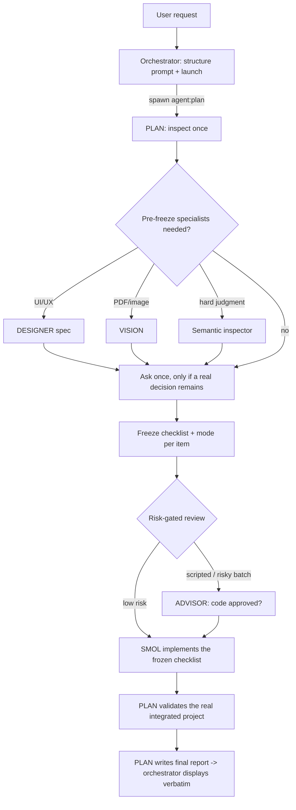

# Agents Flow

A separated-role, multi-agent workflow for **omp** (Oh My Pi). Agents Flow takes a
nontrivial coding/document task and runs it through a disciplined pipeline of
purpose-built agents — a planner, a reviewer, an executor, and read-only
specialists — instead of one agent doing everything. The result is safer,
more auditable changes: one role plans and validates, a different role reviews
risky transforms, and only one role is ever allowed to edit your real files.

- **Skill version:** `3.0.3`
- **Contract schemas:** workflow `3`, profile `3`, execution-mode `1`
- **Runtime:** requires the omp coding-agent harness (it is an instruction
  contract executed by omp's agents, not a standalone program).

---

## Table of contents

- [What it is](#what-it-is)
- [How it works](#how-it-works)
- [Roles](#roles)
- [Repository contents](#repository-contents)
- [Requirements](#requirements)
- [Installation](#installation)
- [Usage](#usage)
- [Model configuration and remapping](#model-configuration-and-remapping)
- [Execution modes](#execution-modes)
- [Safety model](#safety-model)
- [Updating and uninstalling](#updating-and-uninstalling)
- [Troubleshooting](#troubleshooting)
- [License](#license)

---

## What it is

Agents Flow is the "separated-role" path for work that is too large or too
risky for a single foreground agent. It splits a task across dedicated agents
with strict boundaries:

- The **orchestrator** (your current session) only structures the prompt,
  launches the run, and relays messages verbatim.
- **PLAN** owns the run: it inspects the codebase once, asks at most one round
  of questions, freezes a numbered checklist with an execution mode per item,
  routes review and implementation, validates the finished project, and writes
  the final report.
- **SMOL** is the *only* agent allowed to edit your real project files.
- **ADVISOR** independently reviews the risky transforms before they touch
  real files.
- **DESIGNER**, **VISION**, and the **semantic inspector** are read-only
  specialists PLAN calls when a task needs UI/UX, visual/PDF, or hard
  correctness judgment.

This division exists so that the agent that *writes* code is never the same
agent that *approved* it, and so that every change is anchored to an explicit,
frozen acceptance check.

## How it works



The pipeline in words:

```
orchestrator structures prompt -> launch PLAN -> PLAN inspects
-> required pre-freeze specialists -> ask once only if needed
-> freeze checklist and modes -> risk-gated review -> SMOL implements
-> required post-implementation specialists -> PLAN validates and reports
```

## Roles

Each role is a dedicated omp agent, spawned by exact name. They ship in
[`agents/`](agents/).

| Role | Agent file | Editing rights | Responsibility |
|---|---|---|---|
| PLAN | `plan.md` | none (real source) | Run captain: inspection, decisions, checklist + mode selection, routing, integrated validation, final report. |
| ADVISOR | `reviewer.md` | none | Independent review of every scripted transform and every risk-triggered batch edit. Never rubber-stamps. |
| SMOL | `smol.md` | **real project source** | The only agent that edits your files; implements the finalized checklist mechanically. |
| DESIGNER | `designer.md` | none | Read-only UI/UX specification before implementation and visual review after. |
| VISION | `vision.md` | none | Read-only PDF/page/image fidelity inspection against source. |
| Semantic inspector | `inspector_semantic.md` | none | Read-only judgment on a narrow, high-stakes suspect set structural search cannot settle. |

## Repository contents

```
agentsflow/
├── README.md
├── install.sh                     # copies everything into your omp config
├── skills/
│   └── agentsflow/                # the skill itself
│       ├── SKILL.md               # entry contract
│       ├── CHANGELOG.md
│       ├── references/            # authoring, profiles, execution modes, safety, ...
│       └── assets/                # workflow + launcher templates
└── agents/                        # the six companion agent definitions
    ├── plan.md
    ├── reviewer.md
    ├── smol.md
    ├── designer.md
    ├── vision.md
    └── inspector_semantic.md
```

Everything the skill references internally lives under `skills/agentsflow/`
(via `skill://agentsflow/...` URIs). The `agents/` files are required
companions — the skill spawns them by name, so it cannot run without them.

## Requirements

1. **The omp (Oh My Pi) coding-agent harness.** Agents Flow is an instruction
   contract plus agent definitions; omp's `task`/subagent system executes it.
   It does not run outside omp.
2. **Sub-agent spawning enabled** with recursion depth ≥ 2 (default). The
   topology is orchestrator → PLAN → specialists, i.e. two spawn levels.
3. **Model access.** Each agent pins a model in its frontmatter. The defaults
   shipped here are:

   | Agent | Default model | Thinking |
   |---|---|---|
   | `plan` | `openai-codex/gpt-5.5` | high |
   | `reviewer` | `anthropic/claude-opus-4-8` | high |
   | `smol` | `deepseek/deepseek-v4-pro` | off |
   | `designer` | `google-antigravity/gemini-3.1-pro` | high |
   | `vision` | `google-antigravity/gemini-3.1-pro` | — |
   | `inspector_semantic` | `google-antigravity/gemini-3.1-pro` | high |

   If you do not have these exact providers, the flow still works — just
   **remap the models** (see below). Nothing about the workflow logic depends
   on a specific vendor; PLAN wants a strong reasoner, ADVISOR wants an
   independent strong reviewer, SMOL wants a capable executor.

## Installation

### Quick install

```sh
git clone https://github.com/xzhang17/agentsflow.git
cd agentsflow
./install.sh
```

`install.sh` copies:

- `skills/agentsflow/` → `~/.agents/skills/agentsflow/`
- `agents/*.md` → `~/.omp/agent/agents/`

Then start a new omp session so discovery picks them up.

Custom locations are supported via environment variables:

```sh
AGENTSFLOW_SKILLS_DIR="$HOME/.agents/skills" \
PI_CODING_AGENT_DIR="$HOME/.omp/agent" \
./install.sh
```

### Manual install

If you prefer to copy by hand (or install per-project):

```sh
# user-level (global)
cp -R skills/agentsflow ~/.agents/skills/agentsflow
cp agents/*.md ~/.omp/agent/agents/

# OR project-level (only inside one repo)
mkdir -p .agents/skills .omp/agents
cp -R skills/agentsflow .agents/skills/agentsflow
cp agents/*.md .omp/agents/
```

omp discovers user skills in `~/.agents/skills/` and user agents in
`~/.omp/agent/agents/`; the project-level equivalents are `<repo>/.agents/skills/`
and `<repo>/.omp/agents/`.

### Verify

Start omp and run:

```
/skill:agentsflow
```

If the skill body loads, discovery succeeded. To confirm the agents are
visible, ask omp to list available task agents — `plan`, `reviewer`, `smol`,
`designer`, `vision`, and `inspector_semantic` should appear.

## Usage

Agents Flow activates **only when you explicitly ask for it** — it never
hijacks ordinary requests. Trigger it by naming it:

```
Use agentsflow to refactor the auth module: split session handling out of
handlers.py into a new session.py, update all callers, keep the public API
stable, and make the existing tests pass.
```

or

```
Run an Agents Flow workflow to fix the citation numbering across all chapters
of paper/, without changing any equation or figure labels.
```

What happens next:

1. The orchestrator structures your request and launches PLAN.
2. PLAN inspects, then either proceeds or sends **one** short questionnaire if
   a genuine decision remains (zero questions is the norm).
3. PLAN freezes a numbered checklist, routes review + SMOL, validates, and
   returns a final report that the orchestrator shows you verbatim.

You interact mainly at step 2 (answer once) and step 3 (read the report).

### Durable vs direct runs

- **Durable (default):** the orchestrator writes a workflow record and launcher
  under `.agentsflow/` in your project, then launches PLAN with it. Good for
  auditability and reruns.
- **Direct:** if you say "don't generate workflow files" (or ask for immediate
  local work), the same contract is passed inline to PLAN with no files written.

## Model configuration and remapping

You have three ways to point the roles at models you actually have. Pick one.

**A. Per-agent override in omp config (recommended, non-destructive):**

```yaml
# ~/.omp/agent/config.yml
task:
  agentModelOverrides:
    plan: your-provider/strong-reasoner:high
    reviewer: your-provider/independent-reviewer:high
    smol: your-provider/capable-coder
    designer: your-provider/vision-model:high
    vision: your-provider/vision-model
    inspector_semantic: your-provider/vision-model:high
```

**B. Edit the frontmatter** of the files in `agents/` before running
`install.sh` (change the `model:` line in each).

**C. Add fallback chains** so a provider outage doesn't stall a run. Because
subagents pin a single model, give them explicit fallbacks keyed by model or
provider:

```yaml
# ~/.omp/agent/config.yml
retry:
  modelFallback: true
  fallbackChains:
    openai-codex/gpt-5.5:            # PLAN
      - anthropic/claude-opus-4-8:high
    anthropic/claude-opus-4-8:       # ADVISOR
      - openai-codex/gpt-5.5:high
    deepseek/deepseek-v4-pro:        # SMOL
      - your-provider/backup-coder
    google-antigravity/*:            # DESIGNER / VISION / inspector
      - google/*
      - google-vertex/*
```

> Note: the model an Agents Flow agent runs comes from its **agent definition**
> (frontmatter) or `task.agentModelOverrides` — *not* from `modelRoles` in
> `config.yml`. `modelRoles` drives your main session, not these subagents.

## Execution modes

PLAN assigns exactly one mode to every checklist item. This is what keeps edits
mechanical and reviewable:

| Mode | What it means | Review |
|---|---|---|
| `anchored` | SMOL edits one exact site from an exact anchor. | none required |
| `batch-anchored` | SMOL applies an exact `(file, line, old, new)` tuple list with an exact-once-or-refuse applier. | ADVISOR only if the risk trigger fires |
| `scripted-pattern` | A regex/AST transform PLAN authored and dry-ran on a `/tmp` copy. | **mandatory** ADVISOR `code approved` |
| `planned-implementation` | SMOL implements a file-by-file behavior contract with normal engineering judgment inside named boundaries. | as specified |

No scripted transform ever reaches your real files without an independent
ADVISOR approval. Full details live in
[`skills/agentsflow/references/execution-modes.md`](skills/agentsflow/references/execution-modes.md).

## Safety model

Agents Flow is built around hard boundaries (see
[`references/safety.md`](skills/agentsflow/references/safety.md)):

- Only **SMOL** edits real project source. PLAN validates but never edits.
- The orchestrator, after launch, only relays — it never edits, reviews, or
  reinterprets results.
- **No destructive git** (`git reset --hard`, `git checkout -- <file>`,
  `git clean -fd`, `git stash drop`) without your explicit approval in the
  conversation. The workflow never discards your changes to fix its own work.
- **No backups are created automatically.** Agents Flow assumes you manage your
  own restore points (commit or stash before a large run if you want one).
- Secrets are never printed; irreversible/external actions require explicit
  authorization with a stated recovery boundary.

## Updating and uninstalling

**Update:** pull the latest and re-run the installer (it replaces the skill copy
and refreshes the agent files):

```sh
git pull
./install.sh
```

**Uninstall:**

```sh
rm -rf ~/.agents/skills/agentsflow
rm -f ~/.omp/agent/agents/{plan,reviewer,smol,designer,vision,inspector_semantic}.md
```

(Only remove the agent files if no other workflow of yours uses them.)

## Troubleshooting

- **`/skill:agentsflow` not found** — the skill isn't in a discovered directory,
  or `skills.enabled` is off. Confirm it sits at
  `~/.agents/skills/agentsflow/SKILL.md` and start a fresh session.
- **"Unknown agent 'plan'"** — the agent files aren't in
  `~/.omp/agent/agents/`. Re-run `install.sh`.
- **A role fails to start / model unavailable** — you don't have that provider.
  Remap the model (see [above](#model-configuration-and-remapping)).
- **PLAN can't spawn specialists** — recursion depth is too low. Ensure
  `task.maxRecursionDepth` is at least `2`.
- **SMOL's edits don't appear** — task isolation is sandboxing the write. Set
  `task.isolation.mode: none` so SMOL edits the real working tree.

## License

Released under the [MIT License](LICENSE). Copyright (c) 2026 xzhang17.
