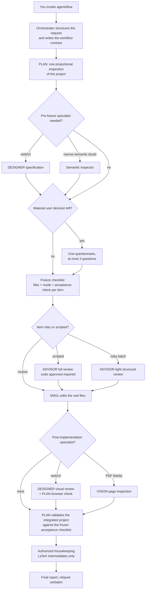

# Agents Flow

A multi-agent workflow for **omp** (Oh My Pi), an AI coding assistant that runs in your terminal.

Agents Flow splits nontrivial project work across a small team of specialized agents with strictly separated powers: one agent plans and validates, one independently reviews risky changes, and exactly one is allowed to edit your files. The agent that writes a change is never the one that approved it, and every change is tied to an acceptance check that is frozen *before* implementation starts.

**Version** 3.0.5 · **License** MIT · **Requires** omp with sub-agent spawning (depth ≥ 2)

Its lightweight sibling, [Quick Flow](https://github.com/xzhang17/quickflow), handles small bounded jobs in a single session with no delegation. See [Quick Flow vs Agents Flow](#quick-flow-vs-agents-flow).

---

## Table of contents

- [Why Agents Flow](#why-agents-flow)
- [Quick Flow vs Agents Flow](#quick-flow-vs-agents-flow)
- [The team](#the-team)
- [How a run works](#how-a-run-works)
- [The workflow contract](#the-workflow-contract)
- [Task profiles](#task-profiles)
- [Execution modes and review](#execution-modes-and-review)
- [User interaction during a run](#user-interaction-during-a-run)
- [Validation](#validation)
- [Safety guarantees](#safety-guarantees)
- [Installation](#installation)
- [Usage](#usage)
- [Choosing the AI models](#choosing-the-ai-models)
- [Repository layout](#repository-layout)
- [Troubleshooting](#troubleshooting)
- [Versioning](#versioning)
- [License](#license)

## Why Agents Flow

A single AI agent doing everything — planning, editing, and grading its own work — has an obvious conflict of interest, and on large or risky jobs its mistakes compound. Agents Flow is built on three ideas:

1. **Separation of powers.** Planning, reviewing, and editing are done by different agents. No agent approves its own work, and only one agent (`smol`) can touch your real files.
2. **Freeze before you act.** The plan is written down as a numbered checklist — each item with exact files, an execution mode, and an observable acceptance check — and locked in before any edit happens. Committed checks can be strengthened later, but never silently weakened or dropped.
3. **Proof over confidence.** Bulk changes are rehearsed on a throwaway copy of the project before touching real files; scripts must pass independent review; and the final result is validated against the frozen acceptance checklist, not against the agent's own summary.

This costs more time and tokens than a single-agent run. That is the intended trade: use Agents Flow for work where a mistake is expensive, and Quick Flow for the rest.

## Quick Flow vs Agents Flow

| | Quick Flow | Agents Flow |
|---|---|---|
| Topology | one agent, entirely in your live session | orchestrator + PLAN + up to five specialist agents |
| Best for | small, bounded, well-defined jobs | multi-file, risky, or judgment-heavy jobs |
| Independent review | none | mandatory for scripts, risk-gated for batch edits |
| File editing | the session agent edits directly | only the dedicated `smol` agent edits |
| Speed | fast | slower, more thorough |
| Install | one skill folder | skill folder + six agent definitions |

The two are deliberately incompatible: a Quick Flow invocation that turns out to need delegation pauses and asks you to switch, rather than quietly spawning agents.

## The team

Each role is a separate omp agent, defined by its own file in [`agents/`](agents/). Roles are spawned by exact name — the workflow never substitutes a general-purpose agent.

| Role | Agent file | Edits your files? | Responsibility |
|---|---|---|---|
| Orchestrator | (your current session) | no | Structures your request into a workflow, launches PLAN, then becomes a passive relay: it forwards PLAN's messages and your answers verbatim, and displays the final report unmodified. It never inspects, edits, or adds its own summary. |
| PLAN | `plan.md` | no | Owns the run: inspects the project once, gathers specialist input, asks you at most one round of questions, freezes the checklist, routes review and implementation, validates the integrated result, and authors the final report. |
| SMOL | `smol.md` | **yes — the only one** | Implements the finalized checklist exactly. Refuses items with stale anchors or missing review records rather than improvising. |
| ADVISOR | `reviewer.md` | no | Independent reviewer. Every transformation script requires its explicit `code approved` verdict before touching real files; risky batch edits get a lighter structural review. |
| DESIGNER | `designer.md` | no | Read-only web/UI specialist: produces an implementation-ready specification before UI work and a visual review after it. |
| VISION | `vision.md` | no | Read-only PDF/image fidelity inspector. Renders only PLAN-assigned PDF pages into private temporary images (via restricted `render_pdf_pages` / `render_pdf_region` tools) and reports discrepancies against bounded criteria. |
| Semantic inspector | `inspector_semantic.md` | no | Narrow escalation for correctness judgments that structural inspection (searching, parsing, diffing) cannot settle. |

## How a run works



In sequence:

1. **Structure and launch.** The orchestrator turns your request into a binding workflow (goal, inputs, selected profiles, requirements, validation expectations), passes a mechanical authoring gate, and spawns PLAN. From this point it only relays messages.
2. **Inspect once.** PLAN performs one proportional inspection: locating the relevant files and call sites, diagnosing the problem, discovering the project's native build/test commands, and classifying every candidate change. Exhaustive corpus-wide counts are done only when a batch or scripted mode is under consideration.
3. **Specialist input.** Web/UI work gets a DESIGNER specification before the checklist is frozen; unresolved narrow correctness questions go to the semantic inspector.
4. **Ask once, if at all.** If a material decision remains that evidence cannot settle, PLAN sends one questionnaire (at most three questions). Zero questions is the norm — discoverable facts are never asked.
5. **Freeze.** PLAN commits a numbered checklist. Each item names its exact files, one of four [execution modes](#execution-modes-and-review), the intended change, and a focused observable acceptance check.
6. **Review, then edit.** Scripted transformations are dry-run on a whole project copy in `/tmp` and must receive ADVISOR's `code approved`; risky batches get ADVISOR-light. Only then does SMOL implement, and only what the checklist says.
7. **Validate and report.** PLAN exercises the real integrated project — narrowest sufficient project-native checks, real browser interaction for UI, compilation and page inspection for LaTeX — performs authorized cleanup, and writes the final report, which the orchestrator shows you word for word.

Throughout the run, PLAN emits one-line status messages at phase boundaries (`PLAN STATUS — <phase>: ...`), and announces any operation expected to exceed 90 seconds, so you always know what state the run is in.

## The workflow contract

By default a run is **durable**: the orchestrator writes two files under `.agentsflow/` in your project before anything starts —

```
.agentsflow/AGENTS_WORKFLOW.md    # the task-specific contract
.agentsflow/AGENTS_LAUNCHER.md    # universal launcher pointing at it
```

The workflow records the goal, named inputs and boundaries, selected profiles, atomic requirements, facts PLAN must discover by inspection, validation expectations, and the stopping condition — plus exact version stamps (`Agents Flow skill: 3.0.5`, `Workflow schema: 3`, `Profile schema: 3`, `Execution-mode schema: 1`). Once written, a workflow is an immutable snapshot: new runs get new collision-free filenames (`AGENTS_WORKFLOW_<slug>.md`), and old snapshots are never rewritten in place, even after a skill upgrade.

If you say "don't create workflow files," the same contract fields are passed directly in PLAN's spawn prompt instead (**direct local** branch); the runtime behavior after launch is identical.

A deliberate boundary: the orchestrator authors the contract *without inspecting your project* — no compiling, diagnosing, or site-hunting before PLAN exists. Anything that requires looking at the project is listed as a fact for PLAN to discover. This keeps the contract honest and the inspection in the hands of the agent that owns the run.

## Task profiles

Profiles are composable rulebooks that define *obligations* — what must be preserved, what counts as done, what evidence proves it — never execution mechanics. There are 19, in four groups (full definitions in [`skills/agentsflow/references/profiles.md`](skills/agentsflow/references/profiles.md)):

- **Intent** (exactly one primary): inquiry, diagnosis, repair, feature implementation, refactor, optimization, translation, formatting, conversion.
- **Artifact** (what is being edited): code, web UI, configuration/data, LaTeX documents, generic documents, generic files.
- **Evidence** (optional overlays defining proof): build/test, visual/browser/PDF, source-reference.
- **Fallback**: `generic-fallback`, used only when no artifact profile clearly applies; PLAN's first inspection resolves it into exactly one specific artifact profile.

Composition is constrained — read-only intents never combine with mutating ones, repair already includes diagnosis, editing requires an artifact profile — and PLAN may add a compatible profile that inspection proves applies, but may never remove or weaken one you selected.

## Execution modes and review

After inspection, PLAN assigns exactly one mode to every checklist item. The mode determines what artifact PLAN must prepare and how much independent review the item gets before SMOL may implement it (full contract in [`skills/agentsflow/references/execution-modes.md`](skills/agentsflow/references/execution-modes.md)):

| Mode | Used for | Required artifact | Independent review |
|---|---|---|---|
| `anchored` | one or a few unique edit sites | exact file + anchor (symbol, line, or unique text) | none |
| `batch-anchored` | a repeated change fully enumerated in advance | exact `(file, line, old, new)` tuple list + an applier that refuses the whole batch on any mismatch | ADVISOR-light, only when the risk trigger fires |
| `scripted-pattern` | a genuine regex/AST transformation at scale | full spec, the script itself, whole-copy `/tmp` dry-run, offender scan, validation evidence | **always** — ADVISOR must return `code approved`; two review rounds maximum |
| `planned-implementation` | new files or substantial coordinated behavior | file-by-file behavior contract with interfaces, error states, and acceptance criteria | none (SMOL exercises bounded judgment inside the contract) |

Guard rails worth knowing:

- The batch applier is **exact-once-or-refuse**: if any tuple's `old` text doesn't occur exactly once on its named line, nothing is written at all — no partial batches.
- The batch risk trigger (public APIs, schemas, cross-file references, deletions, meaningful whitespace, and similar) is what escalates a batch from PLAN's fast path to ADVISOR-light.
- Every scripted item is rehearsed on a complete copy of the project in `/tmp`, where PLAN must prove every catalogued target changed, nothing else changed, edge cases held, the copy still builds, and rerunning is safe — before ADVISOR even sees it.
- A script that fails review cannot be smuggled through as a "batch" instead; downgrading a failed scripted review is prohibited.

## User interaction during a run

A run waits for **at most one user reply**, ever. Either:

- `PLAN QUESTIONNAIRE [I1]` — one consolidated packet after inspection, at most three evidence-grounded questions with bounded options and a recommendation; or
- `PLAN DECISION REQUEST [D1]` — one later bounded decision, only if no questionnaire was sent and a newly revealed choice controls continuation.

Never both, and never questions about discoverable facts, mode preferences, or checklist approval — those are PLAN's job. If continuation is genuinely impossible and no bounded choice can fix it, PLAN sends `PLAN BLOCKED [B1]` stating the reason, the current file state, and narrow next options, then ends the run with a blocked report. A blocked notice is information, not a request to approve a plan.

## Validation

Validation is proportional: the narrowest project-native evidence that proves each frozen acceptance criterion, with equivalent obligations collapsed into one check. Concretely:

- reported defects are reproduced when practical, then shown gone;
- UI changes are exercised in a real browser (by PLAN), plus DESIGNER's visual review;
- LaTeX is compiled with the project's native pipeline and task-relevant diagnostics are checked; when PDF/page fidelity is a committed criterion, VISION must inspect image evidence for every assigned page — PLAN may not substitute its own inspection or text extraction;
- tests are added only for a new observable contract without existing coverage, or when you ask;
- broad formatters, full test suites, and unrelated warning sweeps are avoided unless the changed surface requires them.

A committed check that cannot run is reported as failed or blocked — never silently dropped. Dry-run evidence from `/tmp` copies supplements, but never replaces, validation of the real integrated project.

After full success, the only automatic housekeeping is a bounded LaTeX intermediate cleanup (resolved build boundary, generated-file inventory, `latexmk -c`-based, final PDFs and `.bbl` always preserved) per [`references/latex-cleanup.md`](skills/agentsflow/references/latex-cleanup.md). No other profile inherits automatic cleanup.

## Safety guarantees

Hard rules, canonical in [`skills/agentsflow/references/safety.md`](skills/agentsflow/references/safety.md):

- Only SMOL edits real project files, and only from the finalized checklist. PLAN's scratch work stays outside the project.
- Destructive git commands (`git reset --hard`, `git checkout -- <file>`, `git clean -fd`, `git stash drop`) require your explicit approval in the current conversation. Your uncommitted changes are never discarded to repair the workflow's own mistakes.
- Irreversible or externally visible actions (permanent deletion, publishing, sending) require exact authorization plus recovery and validation boundaries.
- Secrets and credentials are treated as opaque and never printed.
- On suspected corruption, the run stops and reports rather than attempting destructive self-repair.
- No automatic backups are made. If you want a safety net before a big run, create your own restore point first (e.g. `git commit` or `git stash`).

## Installation

### Prerequisites

1. **omp (Oh My Pi).** Agents Flow is a skill plus six agent definitions that omp executes; it is not a standalone program.
2. **Sub-agent spawning to depth 2** (the default): the orchestrator spawns PLAN, and PLAN spawns the specialists.
3. **Access to capable AI models** for the agents — see [Choosing the AI models](#choosing-the-ai-models). No specific vendor is required.

### Install

```sh
git clone https://github.com/xzhang17/agentsflow.git
cd agentsflow
./install.sh
```

`install.sh` copies:

- the skill → `~/.agents/skills/agentsflow/`
- the six agent files → `~/.omp/agent/agents/`

Then start a new omp session so discovery picks them up. Destinations can be overridden:

```sh
AGENTSFLOW_SKILLS_DIR="$HOME/.agents/skills" \
PI_CODING_AGENT_DIR="$HOME/.omp/agent" \
AGENTSFLOW_AGENTS_DIR="$HOME/.omp/agent/agents" \
./install.sh
```

### Manual install

```sh
# globally
cp -R skills/agentsflow ~/.agents/skills/agentsflow
cp agents/*.md ~/.omp/agent/agents/

# or per-project
mkdir -p .agents/skills .omp/agents
cp -R skills/agentsflow .agents/skills/agentsflow
cp agents/*.md .omp/agents/
```

### Verify

In a new omp session, `/skill:agentsflow` should load the instructions, and listing available agents should show `plan`, `reviewer`, `smol`, `designer`, `vision`, and `inspector_semantic`.

## Usage

Agents Flow activates only when you name it — it never takes over ordinary requests, and activation does not carry across turns. Examples:

```
Use agentsflow to reorganize the auth module: move session handling out of
handlers.py into a new session.py, update all callers, keep the public
interface unchanged, and make the existing tests pass.
```

```
Run an Agents Flow workflow to fix the citation numbering across all chapters
of paper/, without changing any equation or figure labels.
```

```
agentsflow: convert every inline figure in chapters 3-5 to the float
environment used in chapter 1; the rendered PDF must be page-identical
except for float placement.
```

You interact at exactly two points: the optional single questionnaire, and the final report. Everything else is visible as status lines.

## Choosing the AI models

Each agent file sets a default model. As shipped:

| Agent | Default model | Thinking effort |
|---|---|---|
| `plan` | `openai-codex/gpt-5.5` | high |
| `reviewer` | `anthropic/claude-opus-4-8` | high |
| `smol` | `deepseek/deepseek-v4-pro` | off |
| `designer` | `google-antigravity/gemini-3.1-pro` | high |
| `vision` | `google-antigravity/gemini-3.1-pro` | default |
| `inspector_semantic` | `google-antigravity/gemini-3.1-pro` | high |

The requirements are functional, not vendor-specific: PLAN needs a strong reasoner, ADVISOR a strong independent reviewer, SMOL a capable and cheap editor, and the DESIGNER/VISION/inspector roles need vision-capable models. Three ways to change them (pick one):

**A. Override in omp settings** (recommended — leaves the repo files untouched):

```yaml
# ~/.omp/agent/config.yml
task:
  agentModelOverrides:
    plan: your-provider/strong-reasoner:high
    reviewer: your-provider/independent-reviewer:high
    smol: your-provider/capable-coder
    designer: your-provider/vision-model:high
    vision: your-provider/vision-model
    inspector_semantic: your-provider/vision-model:high
```

**B. Edit the `model:` line** in each file under `agents/` before running `install.sh`.

**C. Add fallback chains** so one provider's outage doesn't stall a run:

```yaml
# ~/.omp/agent/config.yml
retry:
  modelFallback: true
  fallbackChains:
    openai-codex/gpt-5.5:            # PLAN
      - anthropic/claude-opus-4-8:high
    anthropic/claude-opus-4-8:       # ADVISOR
      - openai-codex/gpt-5.5:high
    deepseek/deepseek-v4-pro:        # SMOL
      - your-provider/backup-coder
    google-antigravity/*:            # DESIGNER / VISION / inspector
      - google/*
      - google-vertex/*
```

> Note: an agent's model comes from its own file or `task.agentModelOverrides` — not from `modelRoles`, which only controls your main session.

## Repository layout

```
agentsflow/
├── README.md
├── LICENSE
├── install.sh                  # copies skill + agents into omp
├── skills/agentsflow/
│   ├── SKILL.md                # the core contract (always loaded on activation)
│   ├── CHANGELOG.md
│   ├── assets/
│   │   ├── AGENTS_WORKFLOW_CORE.template.md   # workflow template
│   │   └── AGENTS_LAUNCHER.template.md        # universal launcher
│   └── references/             # loaded per phase, not all at once
│       ├── workflow-authoring.md   # authoring rules + pre-launch gate
│       ├── profiles.md             # 19 task profiles + composition contract
│       ├── execution-modes.md      # the four modes, review routing, SMOL handoff
│       ├── grilling-intake.md      # questionnaire / decision / blocked protocol
│       ├── safety.md               # scope, secrets, destructive actions, recovery
│       ├── templates.md            # status, packet, and report formats
│       ├── latex-cleanup.md        # canonical LaTeX cleanup procedure
│       └── modes.md                # legacy v2 stub, kept so old snapshots fail clearly
└── agents/                     # the six agent definitions
    ├── plan.md
    ├── reviewer.md
    ├── smol.md
    ├── designer.md
    ├── vision.md
    └── inspector_semantic.md
```

Both halves are required: the skill spawns the agents by exact name, so it cannot run without the `agents/` files installed.

## Troubleshooting

| Symptom | Likely cause and fix |
|---|---|
| `/skill:agentsflow` not found | Skill not at `~/.agents/skills/agentsflow/SKILL.md`, or skills disabled. Re-run `install.sh`, start a new session. |
| `Unknown agent 'plan'` | Agent files missing from `~/.omp/agent/agents/`. Re-run `install.sh`. |
| An agent won't start / model unavailable | You lack that provider. Override or add fallbacks — see [Choosing the AI models](#choosing-the-ai-models). |
| PLAN can't spawn specialists | Recursion depth limited. Ensure `task.maxRecursionDepth` ≥ 2. |
| SMOL's edits don't appear in your files | omp is editing an isolated copy. Set `task.isolation.mode: none`. |
| A run reports "workflow must be regenerated" | The saved workflow's schema predates the installed skill. Old snapshots are never migrated in place; invoke a fresh run. |

## Versioning

The skill carries a semantic version (currently **3.0.5**) plus independent schema numbers for the workflow (`3`), profile (`3`), and execution-mode (`1`) file formats. Schema numbers change only when the file formats change, so generated workflows remain interpretable as versioned snapshots. Full history: [`skills/agentsflow/CHANGELOG.md`](skills/agentsflow/CHANGELOG.md).

## License

[MIT](LICENSE). Copyright (c) 2026 xzhang17.
