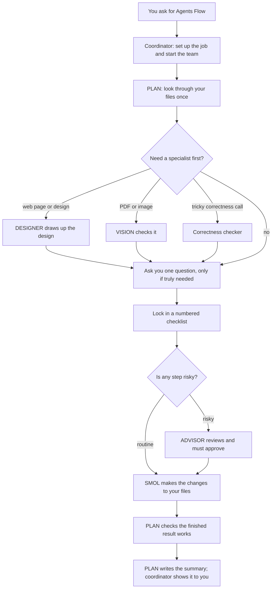

# Agents Flow

Agents Flow is a workflow for **omp** (Oh My Pi), an AI coding assistant that
works in your terminal. Instead of one assistant doing everything, Agents Flow
puts a small team of specialized assistants on the job — a planner, a reviewer,
an editor, and a few look-only specialists — each with a clear role and firm
limits.

The point is safer, easier-to-check work: one assistant plans the job and
confirms the result, a different one reviews the risky changes, and only one is
ever allowed to actually edit your files. The assistant that writes a change is
never the same one that approved it.

- **Version:** 3.0.3
- **What you need:** the omp assistant. Agents Flow is a set of instructions plus
  six assistant descriptions — omp runs them. It is not a separate program you
  run on its own.

---

## Table of contents

- [What it is](#what-it-is)
- [How it works](#how-it-works)
- [Meet the team](#meet-the-team)
- [Repository contents](#repository-contents)
- [What you need](#what-you-need)
- [Installation](#installation)
- [How to use it](#how-to-use-it)
- [Choosing the AI models](#choosing-the-ai-models)
- [How changes are made](#how-changes-are-made)
- [Safety](#safety)
- [Updating and removing](#updating-and-removing)
- [If something goes wrong](#if-something-goes-wrong)
- [License](#license)

---

## What it is

Agents Flow is for bigger or riskier jobs that deserve more care than a single
assistant working alone — a substantial code change, a cleanup that spans many
files, or a document task where a mistake would be costly.

Its simpler sibling, **Quick Flow**, does small jobs by itself in one pass.
Agents Flow is the opposite trade: it's more thorough, because the work is split
across a team with strict boundaries:

- A **coordinator** (your current session) only sets up the job, starts the team,
  and passes messages back and forth word-for-word. It never edits anything
  itself.
- **PLAN** runs the job: it looks through your files once, asks you at most one
  round of questions, writes a numbered checklist and locks it in, hands work to
  the reviewer and the editor, checks the finished result, and writes the
  summary.
- **SMOL** is the *only* assistant allowed to change your real files.
- **ADVISOR** independently reviews the risky changes before they ever touch your
  files.
- **DESIGNER**, **VISION**, and the **correctness checker** are look-only
  specialists PLAN calls in when a job needs design, image/PDF checking, or a
  tricky "is this actually right?" judgment.

Because the roles are separate, every change is tied to a clear, locked-in test
of success, and no assistant gets to approve its own work.

## How it works



In plain steps:

1. You ask for Agents Flow; the coordinator sets up the job and starts PLAN.
2. PLAN looks through your files, brings in any specialist it needs, and asks you
   one short round of questions only if a real decision is left (often it asks
   nothing).
3. PLAN writes a numbered checklist and locks it in.
4. Anything risky is reviewed and approved by ADVISOR first.
5. SMOL makes the changes.
6. PLAN checks that the finished result works and writes a summary, which the
   coordinator shows you word-for-word.

You mainly step in to answer that one optional round of questions and to read the
final summary.

## Meet the team

Each teammate is a separate omp assistant, described by its own file in
[`agents/`](agents/).

| Assistant | File | Can edit your files? | What it does |
|---|---|---|---|
| PLAN | `plan.md` | no | The team lead. Looks through your files, makes the plan, decides who does what, checks the final result, and writes the summary. |
| ADVISOR | `reviewer.md` | no | An independent reviewer. Checks the risky changes before they touch your files, and won't wave through anything it can't verify. |
| SMOL | `smol.md` | **yes — the only one** | The editor. The single assistant allowed to change your real files, and it does only what the checklist says. |
| DESIGNER | `designer.md` | no | Look-only design specialist. Plans how a web page or interface should look before it's built, and reviews it afterward. |
| VISION | `vision.md` | no | Look-only. Compares PDFs, pages, or images against your source to catch anything missing or altered. |
| Correctness checker | `inspector_semantic.md` | no | Look-only. Weighs in on a few tricky "is this actually right?" calls that a plain text search can't settle. |

## Repository contents

```
agentsflow/
├── README.md
├── install.sh          # copies everything into omp
├── skills/
│   └── agentsflow/     # the main instructions
│       ├── SKILL.md
│       ├── CHANGELOG.md
│       ├── references/ # the detailed rulebooks
│       └── assets/     # plan templates
└── agents/             # the six teammate descriptions
    ├── plan.md
    ├── reviewer.md
    ├── smol.md
    ├── designer.md
    ├── vision.md
    └── inspector_semantic.md
```

The instructions live under `skills/agentsflow/`, and the six teammate
descriptions live under `agents/`. Both parts are required — the workflow calls
the teammates by name, so it can't run without them.

## What you need

1. **The omp (Oh My Pi) assistant.** Agents Flow runs inside omp; it doesn't work
   on its own.
2. **omp allowed to start helper assistants, two levels deep.** The coordinator
   starts PLAN, and PLAN starts the specialists — that's two levels. This is the
   normal default setting.
3. **Access to some AI models.** Each teammate is set to use a particular AI
   model (below). If you don't have these exact ones, that's fine — just tell omp
   which models to use instead (see [Choosing the AI models](#choosing-the-ai-models)).
   Nothing depends on a specific company's model; PLAN just needs a strong
   thinker, ADVISOR a strong independent reviewer, and SMOL a capable coder.

   | Teammate | Model it's set to use | Thinking effort |
   |---|---|---|
   | `plan` | `openai-codex/gpt-5.5` | high |
   | `reviewer` | `anthropic/claude-opus-4-8` | high |
   | `smol` | `deepseek/deepseek-v4-pro` | off |
   | `designer` | `google-antigravity/gemini-3.1-pro` | high |
   | `vision` | `google-antigravity/gemini-3.1-pro` | default |
   | `inspector_semantic` | `google-antigravity/gemini-3.1-pro` | high |

## Installation

### The easy way

```sh
git clone https://github.com/xzhang17/agentsflow.git
cd agentsflow
./install.sh
```

`install.sh` copies:

- the instructions → `~/.agents/skills/agentsflow/`
- the six teammate files → `~/.omp/agent/agents/`

Then start a new omp session so it notices them.

New to these commands? `git clone` downloads the files, `cd` moves into the
downloaded folder, and `./install.sh` runs the copy step. You'll need
[Git](https://git-scm.com) installed.

You can send the files elsewhere with environment variables:

```sh
AGENTSFLOW_SKILLS_DIR="$HOME/.agents/skills" \
PI_CODING_AGENT_DIR="$HOME/.omp/agent" \
./install.sh
```

### By hand

If you'd rather copy the files yourself (or set it up for just one project):

```sh
# make it available everywhere
cp -R skills/agentsflow ~/.agents/skills/agentsflow
cp agents/*.md ~/.omp/agent/agents/

# or only inside one project folder
mkdir -p .agents/skills .omp/agents
cp -R skills/agentsflow .agents/skills/agentsflow
cp agents/*.md .omp/agents/
```

omp looks for your instructions in `~/.agents/skills/` and your teammate files in
`~/.omp/agent/agents/`; the per-project spots are that project's own
`.agents/skills/` and `.omp/agents/` folders.

### Check it worked

Start omp and type:

```
/skill:agentsflow
```

If the instructions load, it's installed. To confirm the teammates are there,
ask omp to list its available assistants — `plan`, `reviewer`, `smol`,
`designer`, `vision`, and `inspector_semantic` should all show up.

## How to use it

Agents Flow only starts when you ask for it by name — it won't take over your
normal requests. Just mention it:

```
Use agentsflow to reorganize the auth module: move session handling out of
handlers.py into a new session.py, update everything that calls it, keep the
public interface the same, and make the existing tests pass.
```

or

```
Run an Agents Flow workflow to fix the citation numbering across all chapters
of paper/, without changing any equation or figure labels.
```

What happens:

1. The coordinator sets up your request and starts PLAN.
2. PLAN looks through your files, then either just proceeds or asks **one** short
   round of questions if a real decision is left (asking nothing is the norm).
3. PLAN locks in a numbered checklist, sends work to the reviewer and SMOL,
   checks the result, and gives you a summary shown word-for-word.

You mainly interact at step 2 (answer once) and step 3 (read the summary).

### Two ways it can run

- **Saved (the default):** before starting, the coordinator writes the plan into
  a `.agentsflow/` folder in your project. Good if you want a record to look back
  at or rerun.
- **On the spot:** if you say "don't create any files," it keeps the plan in
  memory and just runs, writing nothing extra.

## Choosing the AI models

The teammates come set to use specific AI models. If you have those, you're done.
If not — or if you'd rather use your own — here are three ways to change them.
Pick one.

**A. Tell omp to swap them (recommended, leaves the files untouched).** Add this
to your omp settings file:

```yaml
# ~/.omp/agent/config.yml
task:
  agentModelOverrides:
    plan: your-provider/strong-thinker:high
    reviewer: your-provider/independent-reviewer:high
    smol: your-provider/capable-coder
    designer: your-provider/vision-model:high
    vision: your-provider/vision-model
    inspector_semantic: your-provider/vision-model:high
```

**B. Edit the teammate files directly.** Open each file in `agents/` and change
its `model:` line before running `install.sh`.

**C. Add backups for each model** so a temporary outage at one AI provider
doesn't stall a run. Each teammate uses one model, so give it a fallback:

```yaml
# ~/.omp/agent/config.yml
retry:
  modelFallback: true
  fallbackChains:
    openai-codex/gpt-5.5:            # PLAN
      - anthropic/claude-opus-4-8:high
    anthropic/claude-opus-4-8:       # ADVISOR
      - openai-codex/gpt-5.5:high
    deepseek/deepseek-v4-pro:        # SMOL
      - your-provider/backup-coder
    google-antigravity/*:            # DESIGNER / VISION / correctness checker
      - google/*
      - google-vertex/*
```

> Good to know: the model a teammate uses comes from its own file (or the
> `agentModelOverrides` setting above) — *not* from the `modelRoles` setting in
> `config.yml`. `modelRoles` controls your main session, not these teammates.

## How changes are made

PLAN sorts every checklist step into one of four kinds, so each change is made in
the safest way that fits. This is what keeps edits precise and easy to review:

| Kind | What it means | Extra review? |
|---|---|---|
| One exact spot | SMOL changes a single, pinpointed place in one file. | none |
| Many exact spots at once | SMOL applies a pre-listed set of exact edits; each must match exactly or the whole batch is refused (no half-done edits). | reviewer, only if it's risky |
| A find-and-replace script | For the same change repeated across many files, PLAN writes a small script and tests it on a throwaway copy first. | **always** — the reviewer must approve the script first |
| Build to a spec | For work needing real judgment, PLAN gives SMOL a detailed description of what each file should do, and SMOL builds it within those limits. | as needed |

No script ever runs on your real files until the reviewer has approved it. The
full details are in
[`skills/agentsflow/references/execution-modes.md`](skills/agentsflow/references/execution-modes.md).

## Safety

Agents Flow is built around firm rules (details in
[`references/safety.md`](skills/agentsflow/references/safety.md)):

- Only **SMOL** changes your files. PLAN checks the result but never edits.
- After starting the team, the coordinator only passes messages along — it never
  edits, reviews, or adds its own explanation.
- It will not run commands that could throw away your work (certain Git "undo"
  commands) without asking you first, and it never discards your changes to cover
  up its own mistake.
- It does not make backups for you. If you want a safety net before a big run,
  save your own restore point first (for example, commit or stash in Git).
- It never prints passwords or secret keys, and anything permanent or that
  reaches the outside world needs your clear go-ahead.

## Updating and removing

**Update** (re-download and re-run the installer, which refreshes both the
instructions and the teammate files):

```sh
git pull
./install.sh
```

**Remove:**

```sh
rm -rf ~/.agents/skills/agentsflow
rm -f ~/.omp/agent/agents/{plan,reviewer,smol,designer,vision,inspector_semantic}.md
```

(Only remove the teammate files if nothing else of yours uses them.)

## If something goes wrong

- **`/skill:agentsflow` isn't found** — the files aren't where omp looks, or
  skills are turned off. Make sure the instructions sit at
  `~/.agents/skills/agentsflow/SKILL.md`, then start a new session.
- **"Unknown agent 'plan'"** — the teammate files aren't in
  `~/.omp/agent/agents/`. Run `install.sh` again.
- **A teammate won't start, or a model isn't available** — you don't have that AI
  provider. Point it at one you do have (see
  [Choosing the AI models](#choosing-the-ai-models)).
- **PLAN can't start its specialists** — omp isn't allowed to go two levels deep.
  Make sure the `task.maxRecursionDepth` setting is at least `2`.
- **SMOL's changes don't show up in your files** — omp is editing a private copy
  instead of your real files. Set `task.isolation.mode: none` in your settings so
  it edits your actual project.

## License

Released under the [MIT License](LICENSE). Copyright (c) 2026 xzhang17.
