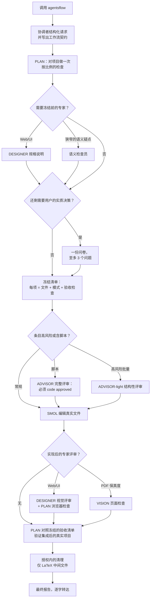

[English](README.md) | 简体中文

# Agents Flow

一个面向 **omp**（Oh My Pi，一款在终端中运行的 AI 编程助手）的多智能体工作流。

Agents Flow 把非平凡的项目工作拆分给一支职权严格分离的专职智能体小队：一个负责规划与验证，一个独立评审高风险改动，而有且仅有一个被允许编辑你的文件。写下改动的智能体永远不是批准它的那个，并且每处改动都绑定一项在实现开始*之前*就冻结的验收检查。

**版本** 3.2.0 · **许可证** MIT · **要求** 支持子智能体派生的 omp（深度 ≥ 2）

它的轻量姊妹项目 [Quick Flow](https://github.com/xzhang17/quickflow) 在单个会话中处理小型有界任务，不做任何委派。参见 [Quick Flow 与 Agents Flow 对比](#quick-flow-与-agents-flow-对比)。

---

## 目录

- [为什么需要 Agents Flow](#为什么需要-agents-flow)
- [Quick Flow 与 Agents Flow 对比](#quick-flow-与-agents-flow-对比)
- [团队构成](#团队构成)
- [一次运行的流程](#一次运行的流程)
- [工作流契约](#工作流契约)
- [任务档案](#任务档案)
- [执行模式与评审](#执行模式与评审)
- [运行中的用户交互](#运行中的用户交互)
- [验证](#验证)
- [安全保证](#安全保证)
- [安装](#安装)
- [使用方法](#使用方法)
- [选择 AI 模型](#选择-ai-模型)
- [仓库结构](#仓库结构)
- [故障排查](#故障排查)
- [版本机制](#版本机制)
- [贡献者](#贡献者)
- [许可证](#许可证)

## 为什么需要 Agents Flow

一个包揽一切的 AI 智能体——自己规划、自己编辑、自己给自己打分——存在显而易见的利益冲突，而且在大型或高风险任务上，它的错误会不断累积。Agents Flow 建立在三个理念之上：

1. **职权分离。** 规划、评审和编辑由不同的智能体完成。没有任何智能体批准自己的工作，并且只有一个智能体（`smol`）能触碰你的真实文件。
2. **先冻结，后行动。** 计划被写成一份带编号的清单——每项列明确切文件、执行模式和可观察的验收检查——并在任何编辑发生之前锁定。已承诺的检查此后只能加强，绝不能被悄悄削弱或丢弃。
3. **证据高于自信。** 批量改动先在项目的一次性副本上演练，然后才触碰真实文件；脚本必须通过独立评审；最终结果对照冻结的验收清单验证，而不是对照智能体自己的总结。

这比单智能体运行花费更多时间和 token。这正是有意的取舍：把 Agents Flow 用在出错代价高昂的工作上，其余交给 Quick Flow。

## Quick Flow 与 Agents Flow 对比

| | Quick Flow | Agents Flow |
|---|---|---|
| 拓扑结构 | 单个智能体，完全在你的实时会话中 | 协调者 + PLAN + 至多五个专职智能体 |
| 适用场景 | 小型、有界、定义明确的任务 | 跨多文件、高风险或需要大量判断的任务 |
| 独立评审 | 无 | 脚本必须评审，批量编辑按风险决定 |
| 文件编辑 | 会话智能体直接编辑 | 只有专职的 `smol` 智能体编辑 |
| 速度 | 快 | 更慢、更彻底 |
| 安装 | 一个技能文件夹 | 技能文件夹 + 六个智能体定义 |

二者被刻意设计为互不兼容：一次 Quick Flow 调用如果最终发现需要委派，会暂停并请你切换，而不是悄悄派生智能体。

## 团队构成

每个角色都是一个独立的 omp 智能体，由 [`agents/`](agents/) 中各自的文件定义。角色按精确名称派生——所需智能体缺失时，运行会以明确的通知阻断；工作流绝不用通用智能体顶替。

| 角色 | 智能体文件 | 会编辑你的文件？ | 职责 |
|---|---|---|---|
| 协调者（Orchestrator） | （你当前的会话） | 否 | 把你的请求结构化为工作流，启动 PLAN，然后转为被动中继：逐字转发 PLAN 的消息和你的回答，并原样展示最终报告。它绝不检查、编辑或附加自己的总结。 |
| PLAN | `plan.md` | 否 | 掌管整个运行：对项目做一次检查，收集专家输入，最多向你发起一轮提问，冻结清单，调度评审与实现，验证集成后的结果，并撰写最终报告。 |
| SMOL | `smol.md` | **是——唯一的一个** | 严格按最终清单实现。遇到过期锚点或缺失评审记录的条目会拒绝执行并退回，而不是即兴发挥。 |
| ADVISOR | `reviewer.md` | 否 | 独立评审者。每个变换脚本都必须获得其明确的 `code approved` 裁定才能触碰真实文件；高风险批量编辑接受较轻的结构性评审。 |
| DESIGNER | `designer.md` | 否 | 只读的 Web/UI 专家：在会修改文件的 UI 工作之前产出可直接实现的规格说明，之后进行视觉评审。只读的 UI 询问会跳过它。 |
| VISION | `vision.md` | 否 | 只读的 PDF/图像保真度检查员。只把 PLAN 指派的 PDF 页面渲染为私有临时图像（通过受限的 `render_pdf_pages` / `render_pdf_region` 工具），并按有界标准报告差异。 |
| 语义检查员 | `inspector_semantic.md` | 否 | 狭窄的升级通道，处理结构化检查（搜索、解析、比对）无法裁定的正确性判断。 |

## 一次运行的流程



按顺序：

1. **结构化并启动。** 协调者把你的请求变成一份约束性工作流（目标、输入、选定档案、需求、验证预期），通过机械化的撰写关卡后派生 PLAN。此后它只转发消息。
2. **只检查一次。** PLAN 执行一次按比例的检查：定位相关文件与调用点、诊断问题、发现项目原生的构建/测试命令，并对每个候选改动分类。只有在考虑批量或脚本模式时才做穷举式的全库计数。
3. **专家输入。** Web/UI 工作在清单冻结前获得 DESIGNER 的规格说明；未解决的狭窄正确性问题交给语义检查员。
4. **至多问一次。** 如果还剩证据无法裁定的实质决策，PLAN 发送一份问卷（至多三个问题）。零提问是常态——可发现的事实绝不会拿来提问。
5. **冻结。** PLAN 提交一份带编号的清单。每项列明确切文件、四种[执行模式](#执行模式与评审)之一、预期改动，以及一项聚焦、可观察的验收检查。
6. **先评审，后编辑。** 脚本化变换先在 `/tmp` 中对项目完整副本做干跑，并且必须获得 ADVISOR 的 `code approved`；高风险批量接受 ADVISOR-light。此后 SMOL 才开始实现，且只实现清单所列内容。
7. **验证并汇报。** PLAN 实际运行集成后的真实项目——最小充分的项目原生检查、UI 用真实浏览器交互、LaTeX 做编译与页面检查——执行授权内的清理，并撰写最终报告，协调者将它一字不差地展示给你。

整个运行期间，PLAN 在阶段边界发出单行状态消息（`PLAN STATUS — <阶段>: ...`），并在任何预计超过 90 秒的操作前预告，让你始终清楚运行处于什么状态。

## 工作流契约

默认情况下一次运行是**持久的**：在一切开始之前，协调者在你的项目里写入 `.agentsflow/` 下的两个文件——

```
.agentsflow/AGENTS_WORKFLOW.md    # 针对本任务的契约
.agentsflow/AGENTS_LAUNCHER.md    # 指向它的通用启动器
```

工作流记录目标、指名的输入与边界、选定档案、原子化需求、留待 PLAN 检查发现的事实、验证预期和停止条件——外加一个用于溯源的 `Agents Flow skill` 版本戳。每次运行都撰写全新的工作流；新的运行绝不覆盖你可能仍在使用的工作流，而是改用免冲突的文件名（`AGENTS_WORKFLOW_<slug>.md`）。

只读运行（询问或诊断）以及没有可写项目根目录的任务会保持你的仓库干净：它们的工作流文件对会写入外部记录根目录——宿主有会话存储时用它（omp 的 `local://agentsflow`），否则用 `~/.agentsflow`，再不行则用操作系统临时目录。需要持久化的恢复包也使用同一根目录。

如果你说"不要生成工作流文件"，同样的契约字段会直接放进 PLAN 的派生提示里（**直接本地**分支）；启动之后的运行时行为完全相同。你也可以让后续请求指向一个已生成的启动器：协调者核实工作流文件存在且版本戳为当前技能版本后，直接在其上启动 PLAN 而不重新撰写——文件缺失或版本过期时会如实报告并提议重新撰写，绝不悄悄迁移。

一条刻意设定的边界：协调者撰写契约时*不检查你的项目*——在 PLAN 存在之前不编译、不诊断、不搜寻改动点。任何需要查看项目才能知道的内容都列为留待 PLAN 发现的事实。这让契约保持诚实，并把检查权交给掌管运行的智能体。

## 任务档案

档案（profile）是可组合的规则手册，定义的是*义务*——必须保留什么、什么算完成、什么证据能证明——而绝非执行机制。共 19 个，分四组（完整定义见 [`skills/agentsflow/references/profiles.md`](skills/agentsflow/references/profiles.md)）：

- **意图（Intent）**（有且仅有一个主意图）：询问、诊断、修复、功能实现、重构、优化、翻译、格式化、转换。
- **工件（Artifact）**（被编辑的对象）：代码、Web UI、配置/数据、LaTeX 文档、通用文档、通用文件。
- **证据（Evidence）**（定义证明方式的可选叠加层）：构建/测试、视觉/浏览器/PDF、来源引用。
- **兜底（Fallback）**：`generic-fallback`，仅在没有工件档案明显适用时使用；PLAN 的首次检查会把它解析为恰好一个具体的工件档案。

组合受到约束——只读意图绝不与会修改文件的意图组合，修复已经包含诊断，编辑必须有工件档案——PLAN 可以补充检查证明适用的兼容档案，但绝不能移除或削弱你选定的档案。

## 执行模式与评审

检查之后，PLAN 给每个清单条目指派恰好一种模式。模式决定 PLAN 必须准备什么工件，以及该条目在 SMOL 实现之前接受多少独立评审（完整契约见 [`skills/agentsflow/references/execution-modes.md`](skills/agentsflow/references/execution-modes.md)）：

| 模式 | 用于 | 必备工件 | 独立评审 |
|---|---|---|---|
| `anchored` | 一处或少数几处唯一的编辑点 | 确切文件 + 锚点（符号、行或唯一文本） | 无 |
| `batch-anchored` | 已预先完整枚举的重复性改动 | 确切的 `(file, line, old, new)` 元组列表 + 任何不匹配即整批拒绝的应用器 | 仅在风险触发器命中时做 ADVISOR-light |
| `scripted-pattern` | 真正需要规模化 regex/AST 变换 | 完整规格、脚本本身、`/tmp` 全副本干跑、遗漏扫描、验证证据 | **必需**——ADVISOR 必须返回 `code approved`；至多两轮评审 |
| `planned-implementation` | 新文件或大量协调性行为 | 逐文件的行为契约，含接口、错误状态和验收标准 | 无（SMOL 在契约之内行使有界判断） |

值得了解的护栏：

- 批量应用器采用**恰好一次否则拒绝**：任何元组的 `old` 文本在指定行上不是恰好出现一次时，整批一个字都不写——不存在半截批量。在每个文件内，元组按行号降序应用，因此改变行数的替换绝不可能移动尚未应用的元组的位置。
- 元组绑定于捕获时的源码状态。如果另一个清单条目先动了某元组所在的文件，该批量会带着新的证据重新捕获，需要时还会重新评审；同一条目第二次因过期被拒绝时，运行直接阻断而不是循环。
- 批量风险触发器（公共 API、模式定义、跨文件引用、删除、有语义的空白等）决定一个批量是走 PLAN 快速通道还是升级到 ADVISOR-light。
- 每个脚本条目都先在 `/tmp` 中对项目完整副本演练：PLAN 必须证明每个编目目标都按规格改变、其余一切未变、边界情况成立、副本仍能构建、重跑安全——然后 ADVISOR 才开始看它。
- 评审失败的脚本不能换个马甲当"批量"混过去；降级一个未通过评审的脚本条目是被禁止的。

## 运行中的用户交互

一次运行至多等待**一次用户回复**。要么是：

- `PLAN QUESTIONNAIRE [I1]`——检查后的一份合并问卷，至多三个有证据支撑的问题，选项有界并附推荐意见；要么是
- `PLAN DECISION REQUEST [D1]`——之后的一次有界决策，仅当未发过问卷、且一个新出现的选择决定运行能否继续时使用。

绝不两者都用，也绝不询问可发现的事实、模式偏好或清单批准——那些是 PLAN 的分内事。如果确实无法继续、且没有任何有界选择能解决，PLAN 会发送 `PLAN BLOCKED [B1]`，说明原因、当前文件状态和狭窄的后续选项，然后以受阻报告结束运行。受阻通知是信息告知，不是请你批准计划。

## 验证

验证是按比例的：用能证明每项冻结验收标准的最小项目原生证据，语义等价的义务合并为一项检查。具体而言：

- 报告的缺陷在可行时先复现，再证明已消失；
- UI 改动在真实浏览器中实际操作（由 PLAN 执行），外加 DESIGNER 的视觉评审；
- LaTeX 用项目原生流水线编译并检查与任务相关的诊断；当 PDF/页面保真度是已承诺的标准时，VISION 必须对每个指派的对比对或页面检查图像证据——PLAN 不得用自己的检查或文本提取顶替；
- 只为没有既有覆盖的新可观察契约添加测试，或在你要求时添加；
- 除非被改动的表面确有要求，否则避免大范围格式化工具、完整测试套件和无关的警告清扫。

无法运行的已承诺检查会被报告为失败或受阻——绝不悄悄丢弃。来自 `/tmp` 副本的干跑证据只是补充，绝不取代对真实集成项目的验证。

全部成功之后，唯一的自动清理是有界的 LaTeX 中间文件清理（解析出构建边界，先 `latexmk -c`，再对边界做已知扩展名清扫，把 `.bbl` 和各章的 `.aux` 也一并移除，最终 PDF、源文件和图片始终保留），定义于 [`references/profiles.md`](skills/agentsflow/references/profiles.md) 的 `artifact-document-latex` 档案。其他任何档案都不继承自动清理。

## 安全保证

硬性规则，权威版本见 [`skills/agentsflow/references/safety.md`](skills/agentsflow/references/safety.md)：

- 只有 SMOL 编辑真实项目文件，且只依据最终清单。PLAN 的草稿工作留在项目之外。
- 破坏性 git 命令（`git reset --hard`、`git checkout -- <file>`、`git clean -fd`、`git stash drop`）需要你在当前对话中明确批准。你未提交的改动绝不会为修补工作流自身的失误而被丢弃。
- 不可逆或对外可见的操作（永久删除、发布、发送）需要精确授权，外加恢复与验证边界。
- 密钥与凭据一律视为不透明内容，绝不打印。
- 疑似损坏时，运行停止并报告，而不是尝试破坏性的自我修复。
- 不做自动备份。想在大型运行前留个后路，请先自建还原点（例如 `git commit` 或 `git stash`）。

## 安装

### 前置条件

1. **omp（Oh My Pi）。** Agents Flow 是由 omp 执行的一个技能加六个智能体定义，不是独立程序。
2. **子智能体派生深度 2**（默认值）：协调者派生 PLAN，PLAN 派生各专家。
3. **可用的高能力 AI 模型**——见[选择 AI 模型](#选择-ai-模型)。不要求特定供应商。

### 安装

```sh
git clone https://github.com/xzhang17/agentsflow.git
cd agentsflow
./install.sh
```

`install.sh` 复制：

- 技能 → `~/.agents/skills/agentsflow/`
- 六个智能体文件 → `~/.omp/agent/agents/`

然后开启一个新的 omp 会话让发现机制加载它们。目标目录可以覆盖：

```sh
AGENTSFLOW_SKILLS_DIR="$HOME/.agents/skills" \
PI_CODING_AGENT_DIR="$HOME/.omp/agent" \
AGENTSFLOW_AGENTS_DIR="$HOME/.omp/agent/agents" \
./install.sh
```

### 手动安装

```sh
# 全局
cp -R skills/agentsflow ~/.agents/skills/agentsflow
cp agents/*.md ~/.omp/agent/agents/

# 或按项目
mkdir -p .agents/skills .omp/agents
cp -R skills/agentsflow .agents/skills/agentsflow
cp agents/*.md .omp/agents/
```

### 验证

在新的 omp 会话中，`/skill:agentsflow` 应能加载指令，且列出可用智能体时应显示 `plan`、`reviewer`、`smol`、`designer`、`vision` 和 `inspector_semantic`。

## 使用方法

Agents Flow 只在你点名时激活——它绝不接管普通请求，且激活不跨轮次延续。示例：

```
Use agentsflow to reorganize the auth module: move session handling out of
handlers.py into a new session.py, update all callers, keep the public
interface unchanged, and make the existing tests pass.
```

```
Run an Agents Flow workflow to fix the citation numbering across all chapters
of paper/, without changing any equation or figure labels.
```

```
agentsflow: convert every inline figure in chapters 3-5 to the float
environment used in chapter 1; the rendered PDF must be page-identical
except for float placement.
```

你恰好在两个节点参与：可选的那一份问卷，以及最终报告。其余一切都以状态行的形式可见。

## 选择 AI 模型

每个智能体文件都设有默认模型。出厂配置为：

| 智能体 | 默认模型 | 思考强度 |
|---|---|---|
| `plan` | `openai-codex/gpt-5.5` | high |
| `reviewer` | `anthropic/claude-opus-4-8` | high |
| `smol` | `deepseek/deepseek-v4-pro` | off |
| `designer` | `google-antigravity/gemini-3.1-pro` | high |
| `vision` | `google-antigravity/gemini-3.1-pro` | 默认 |
| `inspector_semantic` | `google-antigravity/gemini-3.1-pro` | high |

要求是功能性的，与供应商无关：PLAN 需要强推理模型，ADVISOR 需要强独立评审模型，SMOL 需要能力够用且便宜的编辑模型，DESIGNER/VISION/检查员角色需要具备视觉能力的模型。修改方式有三种（择一即可）：

**A. 在 omp 设置中覆盖**（推荐——不动仓库文件）：

```yaml
# ~/.omp/agent/config.yml
task:
  agentModelOverrides:
    plan: your-provider/strong-reasoner:high
    reviewer: your-provider/independent-reviewer:high
    smol: your-provider/capable-coder
    designer: your-provider/vision-model:high
    vision: your-provider/vision-model
    inspector_semantic: your-provider/vision-model:high
```

**B. 编辑 `agents/` 下各文件的 `model:` 行**，然后再运行 `install.sh`。

**C. 添加回退链**，避免单一供应商故障卡住整个运行：

```yaml
# ~/.omp/agent/config.yml
retry:
  modelFallback: true
  fallbackChains:
    openai-codex/gpt-5.5:            # PLAN
      - anthropic/claude-opus-4-8:high
    anthropic/claude-opus-4-8:       # ADVISOR
      - openai-codex/gpt-5.5:high
    deepseek/deepseek-v4-pro:        # SMOL
      - your-provider/backup-coder
    google-antigravity/*:            # DESIGNER / VISION / 检查员
      - google/*
      - google-vertex/*
```

> 注意：智能体的模型来自它自己的文件或 `task.agentModelOverrides`——而不是 `modelRoles`，后者只控制你的主会话。

## 仓库结构

```
agentsflow/
├── README.md
├── README.zh-CN.md
├── LICENSE
├── install.sh                  # 把技能 + 智能体复制进 omp
├── skills/agentsflow/
│   ├── SKILL.md                # 核心契约（激活时始终加载）
│   ├── CHANGELOG.md
│   ├── assets/
│   │   ├── AGENTS_WORKFLOW_CORE.template.md   # 工作流模板
│   │   └── AGENTS_LAUNCHER.template.md        # 通用启动器
│   ├── evals/
│   │   └── scenarios.md        # 发布审计场景（运行时绝不加载）
│   └── references/             # 按阶段加载，而非一次全部
│       ├── workflow-authoring.md   # 撰写规则 + 启动前关卡
│       ├── profiles.md             # 19 个任务档案 + 组合契约 + LaTeX 清理
│       ├── execution-modes.md      # 四种模式、评审调度、SMOL 交接
│       ├── grilling-intake.md      # 问卷 / 决策 / 受阻协议
│       ├── safety.md               # 范围、密钥、破坏性操作、恢复
│       └── templates.md            # 状态、数据包与报告格式
└── agents/                     # 六个智能体定义
    ├── plan.md
    ├── reviewer.md
    ├── smol.md
    ├── designer.md
    ├── vision.md
    └── inspector_semantic.md
```

两部分缺一不可：技能按精确名称派生智能体，没有安装 `agents/` 文件就无法运行。

## 故障排查

| 症状 | 可能原因与解决办法 |
|---|---|
| 找不到 `/skill:agentsflow` | 技能不在 `~/.agents/skills/agentsflow/SKILL.md`，或技能功能被禁用。重新运行 `install.sh`，开启新会话。 |
| `Unknown agent 'plan'` | 智能体文件不在 `~/.omp/agent/agents/`。重新运行 `install.sh`。 |
| 某个智能体启动不了 / 模型不可用 | 你没有该供应商的访问权限。覆盖模型或添加回退链——见[选择 AI 模型](#选择-ai-模型)。 |
| PLAN 无法派生专家 | 递归深度受限。确保 `task.maxRecursionDepth` ≥ 2。 |
| SMOL 的编辑没有出现在你的文件里 | omp 正在编辑隔离副本。设置 `task.isolation.mode: none`。 |

## 版本机制

技能带有单一的语义化版本（当前为 **3.2.0**），为溯源目的盖印在每份生成的工作流中。工作流每次运行都全新撰写，而不做跨版本迁移。每个发布版本都会对照 [`skills/agentsflow/evals/scenarios.md`](skills/agentsflow/evals/scenarios.md) 中的场景用例进行审计——这些可人工核对的用例覆盖契约的各种边界行为（过期的批量元组、评审轮次用尽、智能体缺失、VISION 证据受阻等）。完整历史见 [`skills/agentsflow/CHANGELOG.md`](skills/agentsflow/CHANGELOG.md)。

## 贡献者

- [xzhang17](https://github.com/xzhang17) —— 作者与维护者
- Claude（Anthropic）—— 开发助手

## 许可证

[MIT](LICENSE)。Copyright (c) 2026 xzhang17。
